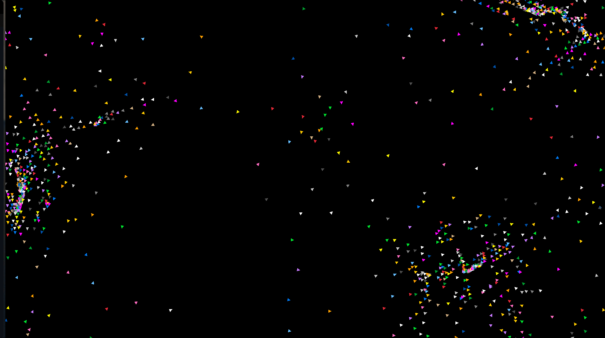

# Boids Simulator



## Table of Contents

- [Overview](#overview)
- [Features](#features)
- [Getting Started](#getting-started)
  - [Prerequisites](#prerequisites)
  - [Installation](#installation)
- [Customization](#customization)
- [Acknowledgments](#acknowledgments)

## Overview

The Boids Simulator is a simple and mesmerizing simulation that replicates the flocking behavior of birds. In this simulation, you can observe individual agents (boids) following three primary behaviors: **separation**, **alignment**, and **cohesion**. These simple rules result in the emergence of complex and natural-looking flocking patterns.

## Features

- Realistic flocking behavior simulation.
- A configurable number of boids.
- Colorful representation with varying colors.
- Interactive window with smooth rendering.

## Getting Started

Follow these steps to run the Boids Simulator on your machine:

### Prerequisites

1. [Zig](https://ziglang.org/download/): Ensure you have Zig installed on your system.

### Installation

1. Clone the repository:

   ```bash
   git clone git@github.com:avi0010/zig-boids.git
   ```

2. Navigate to the project directory:

   ```bash
   cd zig-boids
   ```

3. Build and run the simulation:

   ```bash
   zig build run
   ```

## Customization
Feel free to experiment with the code and customize the simulation. You can modify the behavior of boids by changing the rules in the **boid.zig** file or adding additional forces.

## Acknowledgments
Special thanks to the Zig programming language community and the Raylib library for their contributions and support.

If you have any questions or suggestions, please feel free to open an issue or submit a pull request. Enjoy the Boids Simulator!
